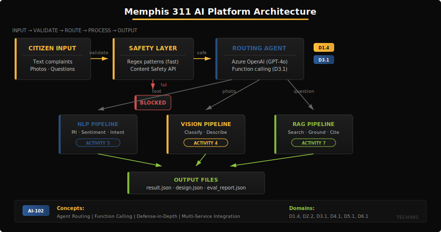
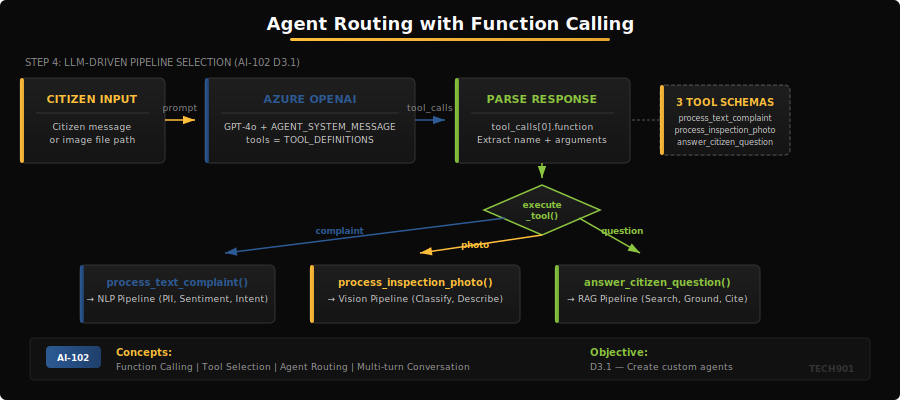
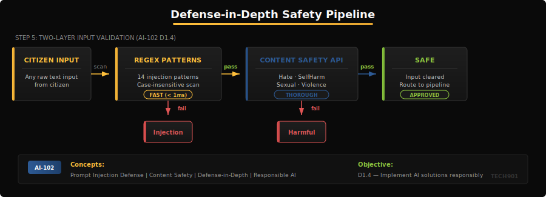

# Activity 8 - Memphis 311 AI Platform (Capstone)

This capstone activity brings everything together. You will build an integrated AI platform for Memphis 311 services that routes citizen interactions to the right pipeline -- text complaints through NLP, inspection photos through vision, and citizen questions through RAG. An AI agent with function calling handles the routing, while content safety and prompt injection defense protect every input.

## Learning Objectives

By the end of this activity, you will be able to:

- Integrate multiple Azure AI services into a unified platform
- Implement agent routing with function calling
- Defend against prompt injection attacks
- Track telemetry across multi-service pipelines
- Document architecture decisions and evaluate system quality

## What Makes This a Capstone?

You built the NLP pipeline in Activity 5, the vision pipeline in Activity 4, and the RAG pipeline in Activity 7. This activity integrates all three under a single routing agent. The **one new skill** is agent routing with function calling (D3.1) -- the LLM decides which pipeline to invoke based on the citizen's input. Everything else is integration work: wiring up your prior code, adding safety checks, and measuring quality.



The `design.json` output is also new. It asks you to articulate *why* you made your architecture choices -- which matters as much as getting the code to run.

> [!NOTE]
> **What You Will Learn**
> - Agent routing with function calling (AI-102 Domain 3.1)
> - Multi-service pipeline integration
> - Prompt injection defense patterns
> - Operational telemetry for AI workloads
> - Architecture documentation and evaluation

## Prerequisites

- Completed Activities 4, 5, and 7
- All Azure service endpoints configured (OpenAI, Language, Search, Document Intelligence, Content Safety)

## Setup

1. Copy `.env.example` to `.env` and fill in ALL service credentials
2. Install dependencies:
   ```bash
   pip install -r requirements.txt
   ```
3. Generate placeholder test images:

> [!NOTE]
> Run `python data/generate_test_images.py` to create placeholder test images before running the pipeline.

> [!WARNING]
> This activity requires credentials for multiple Azure services. Make sure all endpoints from Activities 4-7 are available.

### Files to Edit

| Step | File(s) | Prior Activity |
|------|---------|---------------|
| 1 -- NLP Pipeline | `app/nlp_pipeline.py` | Activity 5 |
| 2 -- Vision Pipeline | `app/vision_pipeline.py` | Activity 4 |
| 3 -- RAG Pipeline | `app/rag_pipeline.py` | Activity 7 |
| 4 -- Agent Routing | `app/agent.py` | NEW |
| 5 -- Safety Checks | `app/safety.py` | NEW |
| 6 -- Telemetry & Eval | `app/telemetry.py`, `app/eval.py` | NEW |

## Step 1: Text Complaint Intake

Open `app/nlp_pipeline.py` and implement the four functions: `redact_pii()`, `analyze_sentiment()`, `classify_intent()`, and `process_complaint()`. The orchestrator in `app/main.py` calls `process_text_complaint()`, which should delegate to your pipeline module.

Adapt your NLP pipeline from Activity 5:
- Redact PII from the raw complaint text
- Analyze sentiment of the redacted text
- Classify the citizen's intent
- Extract key phrases for department routing

> [!WARNING]
> PII redaction MUST happen first. Sentiment analysis and intent classification operate on the redacted text so that personal information never reaches downstream models.

> [!TIP]
> Activity 5 used CLU for intent classification; here you'll use Azure OpenAI instead. The PII redaction and sentiment analysis functions translate directly from Activity 5.

> [!TIP]
> You can copy and adapt your Activity 5 functions into `app/nlp_pipeline.py`. The lazy client initialization pattern is already set up for you -- just uncomment the client configuration.

> [!NOTE]
> **Self-Check** (10 points)
> ```bash
> pytest tests/test_basic.py::test_outputs_has_text_intake -v
> ```

## Step 2: Inspection Photo Intake

Open `app/vision_pipeline.py` and implement `classify_photo()`, `describe_finding()`, and `process_photo()`. The orchestrator's `process_inspection_photo()` delegates to this module.

Reuse your vision pipeline from Activity 4:
- Classify the inspection photo into a category
- Generate a human-readable description of the finding

> [!TIP]
> GPT-4o accepts images as base64-encoded strings in the message content. Use `utils.encode_image_base64()` (already implemented in `app/utils.py`) to convert the photo file to base64 before sending it to the model.

> [!NOTE]
> **Self-Check** (10 points)
> ```bash
> pytest tests/test_basic.py::test_outputs_has_photo_intake -v
> ```

## Step 3: Citizen Question Intake

Open `app/rag_pipeline.py` and implement `search_knowledge_base()`, `generate_grounded_answer()`, and `process_question()`. The orchestrator's `answer_citizen_question()` delegates to this module.

Reuse your RAG pipeline from Activity 7:
- Search the Memphis knowledge base for relevant documents
- Generate a grounded answer with source citations
- Indicate whether the answer is grounded in retrieved documents

> [!TIP]
> Grounding means the model's answer comes from the retrieved documents, not its general knowledge. Include source titles in your citations and set `grounded=True` only when the answer references specific retrieved content.

> [!NOTE]
> **Self-Check** (10 points)
> ```bash
> pytest tests/test_basic.py::test_outputs_has_question_intake -v
> ```

## Step 4: Agent Routing with Function Calling



Open `app/agent.py` and implement `route_with_agent()`, `execute_tool()`, and `multi_turn_conversation()`. This is the **main new skill** in this activity.

> [!IMPORTANT]
> `TOOL_DEFINITIONS` and `AGENT_SYSTEM_MESSAGE` are already provided in `app/agent.py` -- you do not need to write them. Your job is to use them in the routing functions.

Build an AI agent that selects the correct pipeline:
- Call Azure OpenAI with `tools=TOOL_DEFINITIONS` so the model can choose which function to invoke
- Parse the `tool_calls` response to determine which pipeline was selected
- Execute the selected pipeline through `execute_tool()`
- For `multi_turn_conversation()`, implement a 2-turn route-and-confirm flow

The orchestrator's `route_input()` function ties this together: when `input_type` is "auto", it uses the agent to decide; otherwise it dispatches directly.

> [!IMPORTANT]
> **AI-102 Exam Connection (D3.1):** Microsoft Foundry Agent Service does in a managed way what your code does manually -- routing, tool execution, and conversation memory. Understanding the manual approach here helps you evaluate when managed agents are appropriate versus when you need custom control.

> [!NOTE]
> **Self-Check** (10 points)
> ```bash
> pytest tests/test_basic.py::test_outputs_has_agent_routing -v
> ```

## Step 5: Prompt Injection Defense and Content Safety



Open `app/safety.py` and implement `check_injection()`, `check_content_safety()`, and `full_safety_check()`. The orchestrator's `check_safety()` delegates to this module.

Protect the platform from malicious inputs using a defense-in-depth approach:

1. **Pattern matching (fast):** `INJECTION_PATTERNS` is pre-filled with common injection phrases. `check_injection()` scans input against these regex patterns with no API call needed.
2. **Content Safety API (thorough):** `check_content_safety()` calls Azure Content Safety for harmful content detection across four categories (Hate, SelfHarm, Sexual, Violence).
3. **Combined check:** `full_safety_check()` runs patterns first (fast rejection), then the API for anything that passes.

> [!WARNING]
> Defense-in-depth means using BOTH checks. Pattern matching catches obvious injection attempts instantly. The Content Safety API catches harmful content that regex patterns miss. Neither alone is sufficient.

All citizen inputs must pass safety checks before processing. A single unfiltered injection could compromise the entire platform.

> [!NOTE]
> **Self-Check** (10 points)
> ```bash
> pytest tests/test_basic.py::test_safety_blocks_injection -v
> ```

## Step 6: Telemetry and Evaluation

Complete the `Telemetry` class in `app/telemetry.py` and the evaluation functions in `app/eval.py`.

**Telemetry** (`app/telemetry.py`): Track operational metrics across all pipeline calls:
- `record_call()` -- log pipeline name, duration in milliseconds, and token count
- `record_error()` -- log pipeline name and error message
- `to_dict()` -- export a summary with totals and details

**Evaluation** (`app/eval.py`): Measure platform quality:
- `evaluate_routing_accuracy()` -- percentage of inputs routed to the correct pipeline
- `evaluate_safety_block_rate()` -- percentage of adversarial inputs blocked
- `generate_eval_report()` -- produce the `eval_report.json` content

Use `data/eval_set.json` (20 labeled cases) for routing evaluation and `data/adversarial.json` (8 attack prompts) for safety evaluation.

> [!NOTE]
> **Self-Check** (10 points)
> ```bash
> pytest tests/test_basic.py::test_telemetry_present -v
> ```

## Architecture Documentation

After implementing the platform, fill in `design.json` with your architecture decisions:
- Which pipelines did you implement?
- How does routing work?
- What is your safety approach?
- Why did you make these choices? (The `rationale` field should be at least 50 words.)

> [!NOTE]
> **Self-Check** (10 points)
> ```bash
> pytest tests/test_basic.py::test_design_has_rationale -v
> ```

## Running and Submitting

> [!WARNING]
> **Error Handling**: Wrap each pipeline call in a try/except block. If one pipeline fails (e.g., missing credentials or images), the others should still produce output. The autograder accepts `"partial"` status in result.json.

Run the full platform:

```bash
python app/main.py
```

> [!TIP]
> If you see an error like `python: can't open file 'app/main.py'`, you are in the wrong directory. `cd` into the folder that contains `app/` and `tests/`, then try again.

Verify all tests pass:

```bash
pytest tests/ -v
```

Check that all three output files are generated:
- `result.json` -- pipeline results
- `design.json` -- architecture decisions
- `eval_report.json` -- quality metrics

> [!WARNING]
> Your script must be able to generate all three output files when it runs (verify by running `python app/main.py`). The autograder checks all of them.

Push your changes to trigger the autograder:

```bash
git add app/ REFLECTION.md
git commit -m "Complete Activity 8"
git push
```
